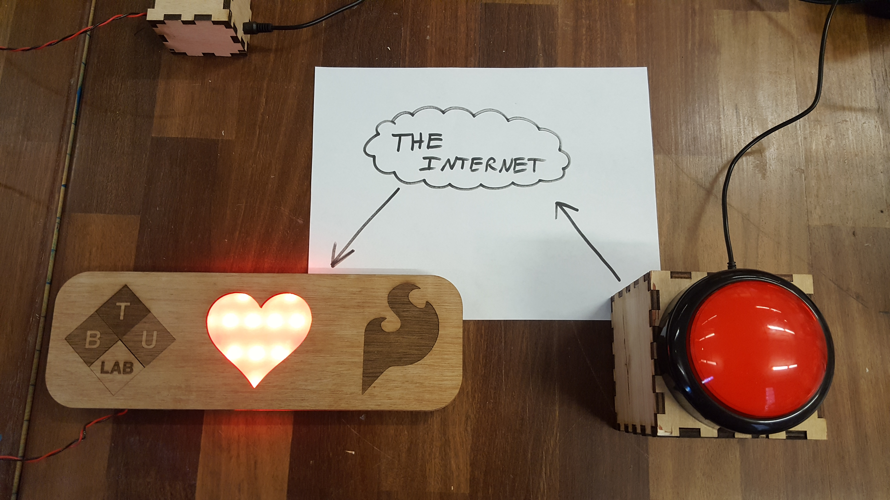
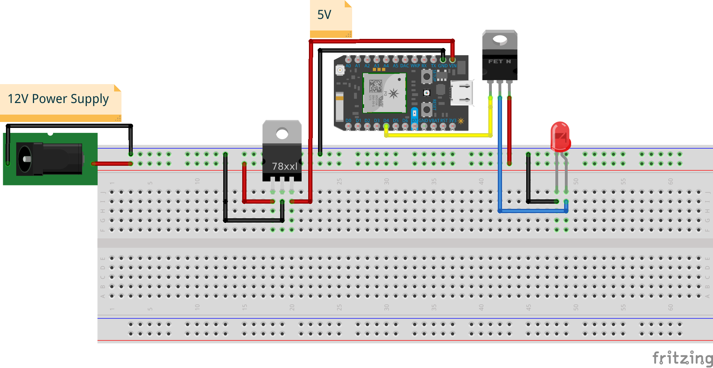
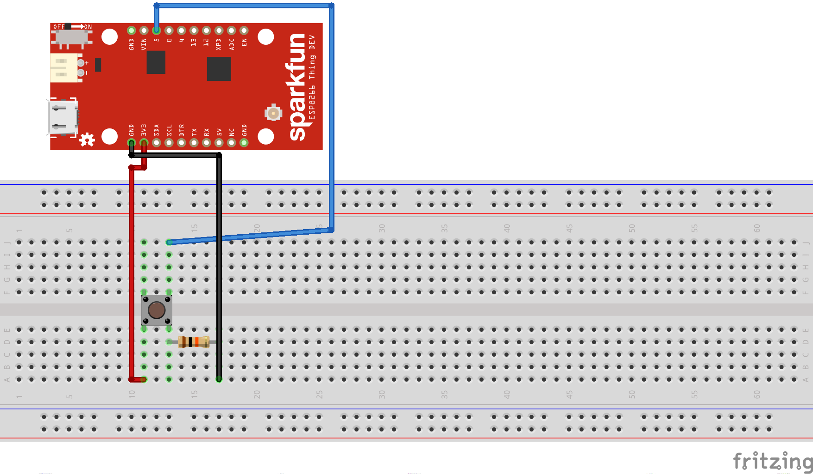

# Sparkfun IoT Thank You Sign

## What is this?

This sign was created as a gift from the BTU Lab to Sparkfun Electronics for sponsoring the lab. The button resides in the BTU Lab, while the sign is hung up at Sparkfun. When you press the button, the heart on the sign blinks a few times in quick succession.

You can check out a video of the button [here](https://www.youtube.com/watch?v=_E-BaDbq4Dw)

## Parts Used
The button uses Sparkfun's breakout of the esp8266 [(The Thing)](https://www.sparkfun.com/products/13231), while the sign uses the [Particle Photon](https://www.particle.io/products/hardware/photon-wifi-dev-kit).

### Wiring Diagrams

Note: The red LED here is representative of an LED strip in the actual sign. The LED strip has built in resistors. Make sure you add a resistor between your voltage source and your LED if you aren't using strips that have them baked in!

 

## How it works
The Thing sends a GET request containing the Photon's unique id and the account's access token, which passes a payload onto the Photon, and runs a function to blink the lights.

The GET request in "button.ino" here is generalized, as to not give out the id and access token. Make sure you replace the appropriate sections of the url before making your own sign!

The Paticle code is based on the simple "Control LEDS over the 'net" example [here](https://docs.particle.io/guide/getting-started/examples/core/).
